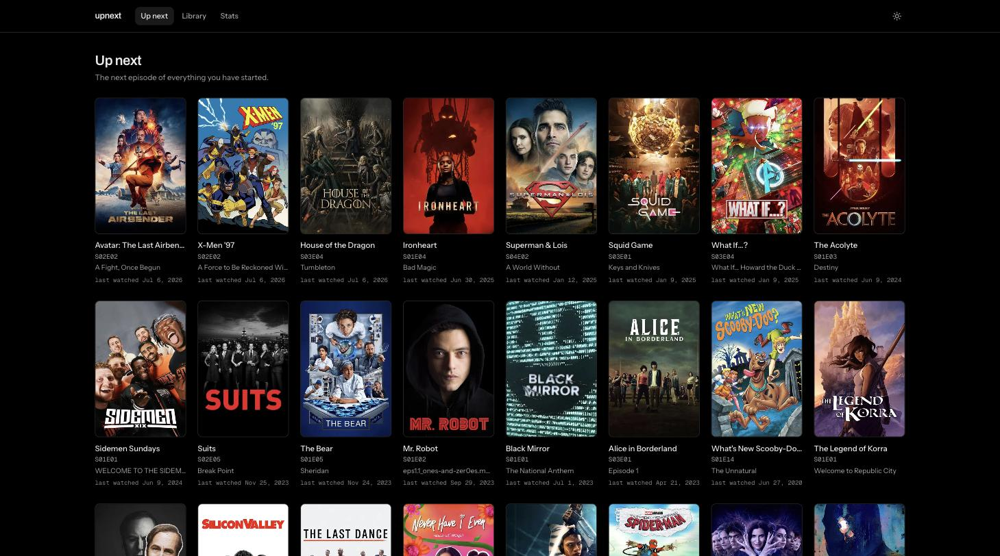
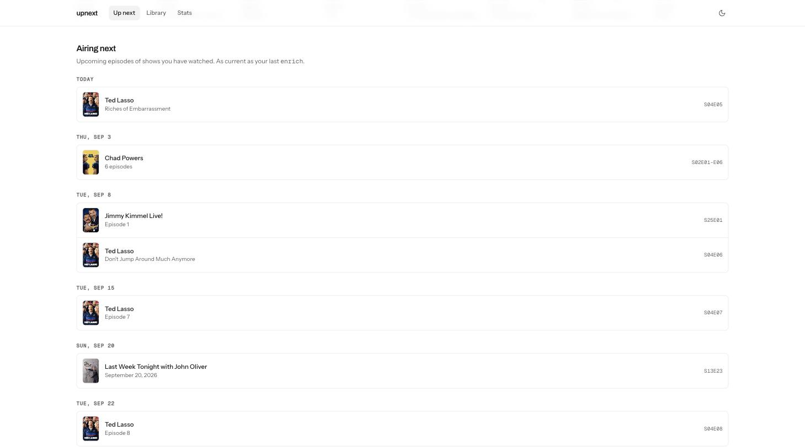
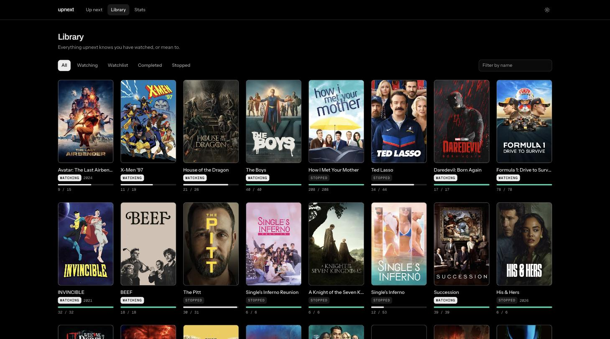
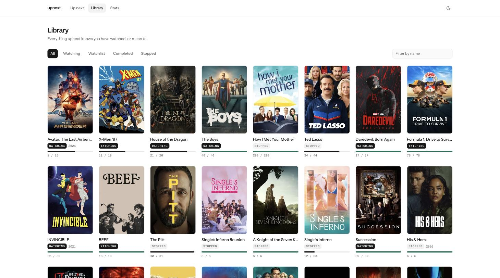
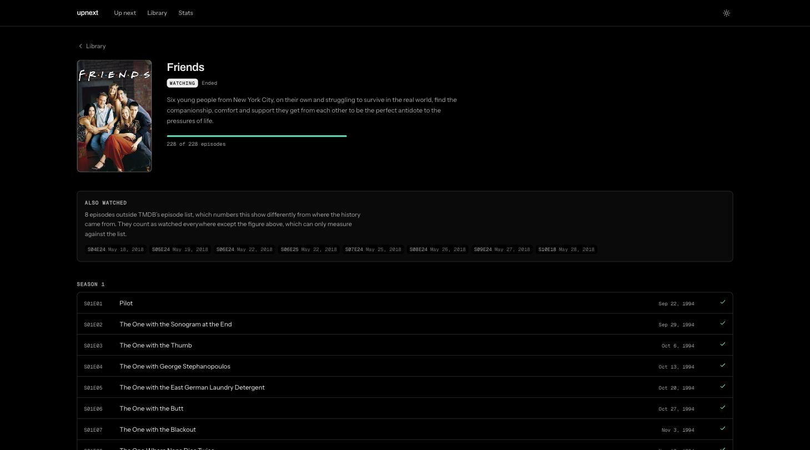
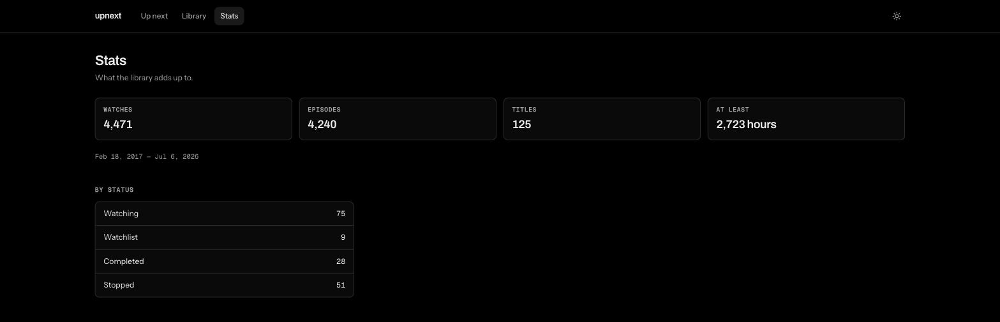

# upnext

A personal watch tracker that runs on your own machine. It imports your viewing
history, resolves every show against [TMDB](https://www.themoviedb.org) for real
episode lists and artwork, and tells you what to put on next. The whole library
is one SQLite file you own.



## Screens

**Airing next** — below the shelf, what has not come out yet: upcoming episodes
of shows you have watched, ordered by the calendar and grouped by day. A whole
season landing at once is one row rather than eight.



**Library** — everything you have watched or mean to, filterable by status and
searchable by name. Light and dark are one class on `<html>`.

| | |
| --- | --- |
|  |  |

**A title** — artwork, progress, every episode by season with what you have
seen, and any viewings TMDB's episode list cannot account for.



**Stats** — what the library adds up to.



## Getting started

```sh
just install                       # venv, locked dependencies, git hooks
cp .env.template .env              # then add a TMDB key, see below
just import ~/Documents/tv-time-data
just enrich
just ui                            # http://localhost:8000
```

`just doctor` reports what this machine is configured for: whether the key is
set, whether the library exists, and how much of it is still unenriched.

The library is a single SQLite file at `~/.upnext/library.db`. Delete it and
re-import; nothing else holds state.

### The TMDB key

Sign up at [themoviedb.org](https://www.themoviedb.org/signup), then request a
key under [Settings → API](https://www.themoviedb.org/settings/api). Choose
**Developer**: it is free, needs no card, and personal use is within its terms.
Copy the value labelled **API Key** — the v3 one, a 32-character hex string, not
the much longer read access token.

It goes in `.env` as `UPNEXT_TMDB_API_KEY`, which is gitignored and never leaves
the machine. `upnext import` and the API do not need it; `upnext enrich` is the
one command that does, and it says so up front rather than failing partway
through.

## Commands

| Command | What it does |
| --- | --- |
| `upnext import <dir>` | read an export folder into the library — offline, no key |
| `upnext enrich [--limit N]` | resolve every unenriched title against TMDB |
| `upnext relink` | re-match recorded watches against stored episodes, no network |
| `upnext move --title <id> --season <n> --to <tmdb_id> [--as-season <n>]` | move a season's watches to the title they belong to |
| `upnext stats` | summarise the library |
| `upnext serve [--host --port]` | the API, plus the built UI if `web/dist` exists |

`just` wraps each of these (`just import`, `just enrich`, …); `just ui` builds
the front end first and serves both from one process.

## How it works

**Import** is a pure translation of an export. No network, no API key, and it
converges on re-runs — the same export imported twice leaves the library exactly
as it was. The one importer today reads a [TV Time](https://www.tvtime.com) GDPR
export, taking five of its CSVs: the episode-watch log, which shows are followed
and whether archived, the "for later" list and favourites, a per-show seen
count, and star ratings. Everything else in an export is account plumbing —
tokens, IP logs, device identifiers — and is deliberately never read.

**The export is not safe to commit.** It contains live OAuth tokens. `.gitignore`
covers the usual folder names and `detect-private-key` runs pre-commit, but the
export belongs outside the repo.

**Enrich** is where TMDB comes in. It writes the episode list and matches the
imported history onto it. A show's id in the export is a TheTVDB id, and TMDB's
`/find` endpoint maps one straight to a TMDB id — so enrichment is an identity
lookup, not a name search, for nearly everything. Name search is the fallback,
and it is strict: the first result only, and only when the year agrees. A show
TMDB has never heard of stays in the library exactly as the export described it.

TMDB rather than IMDb because IMDb has no free public API; rather than TheTVDB
because v4 gates most data behind a subscriber PIN.

### Statuses

Four buckets, and a title with no relationship to you has no state row at all:

| Status | Meaning |
| --- | --- |
| `watching` | followed and not finished |
| `completed` | seen it all |
| `stopped` | history, but no longer followed |
| `watchlist` | for later, nothing watched yet |

### Progress and history are different counts

TMDB says what a show *is* — its seasons, its episodes, their names and air
dates. The export says what was *watched*, in whatever vocabulary the exporting
service used. So the `episodes` table holds TMDB's list and nothing else: an
import records a viewing with the season and episode number its source gave, and
enrichment matches those to real episodes afterwards.

Where they line up — the overwhelming majority — a watch points at a catalog
episode and progress is a fraction. Where they do not, the viewing keeps the
numbering it came with and is shown apart, under **Also watched** on the title
page. The two counts are never added together: one measures against TMDB's list,
the other is everything that list cannot account for.

Matching is exact on episode number and never approximate — deciding a viewing
of S06E25 was "probably" S06E24 would put a guess into the one table that has to
be the truth. Two disagreements about *shape* are resolvable on evidence, and
both are handled:

- **Seasons labelled by year.** Where a source numbers seasons by calendar year
  and TMDB numbers them 1..N, a season labelled `2019` resolves to whichever
  catalog season aired in 2019, from TMDB's own air dates.
- **A run the catalog keeps flat.** Where a source splits into seasons what TMDB
  lists as one, the two orderings are laid side by side — but only when the
  catalog has exactly one season, the source names exactly as many episodes, and
  every watch that already matched by number agrees with the ordering. A partly
  watched show fails that test and is left alone, because there is no way to know
  how long its seasons were.

Three smaller disagreements, all handled without inventing data:

- **Unnumbered episodes.** An episode number of 0 means the source recorded the
  watch but not which episode. It is kept against the show with no episode
  attached, so the viewing count stays honest and the episode list stays short.
- **Bulk marks.** Marking a whole season watched stamps every episode with the
  same second, so a watch is identified by the source's own episode id wherever
  it has one, and by numbering plus timestamp where it does not.
- **Specials.** Season 0 is specials everywhere, and TMDB leaves them out of its
  episode count. They are stored, listed and counted as watched, but they are
  never progress and never the next thing to watch.

### When a season belongs to another title

Sometimes the disagreement is not about episodes but about what counts as one
show — a spin-off filed as season 2 of its parent, or a revival filed as later
seasons of the original, where TMDB keeps each as its own title. `upnext move`
puts those viewings where they belong:

```sh
upnext move --title 73 --season 2 --to 109958 --as-season 1
```

It is a person's call rather than an automatic one, and deliberately so: TMDB
has no "this is season 2 of that" relation, so anything automatic would be a
name search and a hope.

## The API

| Route | What it returns |
| --- | --- |
| `GET /api/titles?status=&kind=` | the library, with counted progress per title |
| `GET /api/titles/{id}` | one title, its episodes with watch counts, and any viewings TMDB cannot account for |
| `GET /api/up-next` | the next unwatched episode of everything in progress |
| `GET /api/airing` | episodes airing today or later, of shows with watch history, soonest first |
| `GET /api/stats` | episodes, titles, date range, runtime, counts by status |
| `GET /api/config` | the TMDB image base the client builds poster URLs from |

"Next" is the lowest-numbered unwatched episode, not the highest watched plus
one — the second definition silently swallows a gap when someone skips around.

The two shelves answer different questions and neither is folded into the
other: `up-next` is a backlog, ordered by what was watched most recently, and
`airing` is a schedule, ordered by the calendar. `airing` selects on watch
history rather than status, because a show whose new season is a month out has
usually been finished and filed `completed` or `stopped` — filtering on
`watching` would empty the list of exactly what it exists to surface. It is
only ever as current as the last `upnext enrich`, which is what wrote the
episode list it reads.

## The front end

One React app, built by Vite and served by the same FastAPI process, so there is
one port and one command in normal use. While working on it, run the two halves
apart and get hot reload:

```sh
just serve     # the API on :8000
just web       # Vite on :5173, proxying /api across to it
```

`web/dist` is gitignored and built on demand. Without it the API still serves —
`upnext serve` on a fresh clone is the API alone, and says so in the log.

```
web/src/
  lib/api.ts        the client, typed against the wire models in api.py
  lib/format.ts     posters, episode codes, progress, dates — pure and tested
  lib/queries.ts    every query and its cache key
  components/ui/    poster, progress bar, status badge, loading/empty/error
  panels/           UpNext, Library, Title, Stats — one per route
```

Color comes from semantic tokens (`bg-card`, `text-muted-foreground`) that
resolve through `light-dark()`, so light and dark are one class on `<html>` and
no JavaScript recolors anything. A lint rule rejects a raw Tailwind palette
utility, which cannot follow a mode change. `pnpm build` enforces a gzip budget
on the entry bundle, because everything in it is time the page is blank.

## Development

```sh
just check              # lint, types, agent docs, tests, coverage floor — what CI runs
just check-web          # the front end: lint, types, tests, build
just fmt                # ruff fix + format
just test               # the hermetic suite: no network, no key needed
just test-integration   # the tests that call TMDB (need a key)
just doctor             # what this machine is set up for, and what it is not
```

Layout — ports and adapters, with the dependency arrows pointing inward:

```
src/upnext/
  domain/              the vocabulary, the errors, and the ports the core needs
    models.py            Title, Episode, Watch, Status — what everything speaks
    errors.py            every failure upnext raises on purpose
    ports.py             Catalog, WatchLibrary, ImportSource
  application/         the use cases, working against ports only
    enrichment.py        resolve a title against a catalog, fill in the data
    importing.py         read an export, write a library
  adapters/
    inbound/             the only layer that prints or returns a status code
      cli/                 commands.py, output.py
      web/api.py           the read API
    outbound/
      catalog/tmdb.py      the Catalog port, over TMDB
      importers/tvtime.py  the ImportSource port, over a TV Time export
      store/               schema.sql, connections, the repository
  config/settings.py   environment and .env
  bootstrap.py         the one module that names concrete implementations
```

`domain/` imports nothing else in the package, `application/` imports `domain/`
only, and `bootstrap.py` is the single place a concrete class is named — so
another importer is a registry entry, and another catalog is one class
satisfying one protocol, neither of which is a change to a use case.

Agent rules live in [`AGENTS.md`](AGENTS.md); `CLAUDE.md` is a symlink to it, so
there is one file rather than two that drift. Skills live in
[`.agents/skills/`](.agents/skills/) — `improve` (audit the repo and write
implementation plans), `review-tests` (the bar for tests here) and
`thermo-nuclear-code-quality-review` (a strict maintainability pass).
`just check-agents` enforces the symlink, the 200-line cap on `AGENTS.md`, and
that every skill has frontmatter and an index entry.
